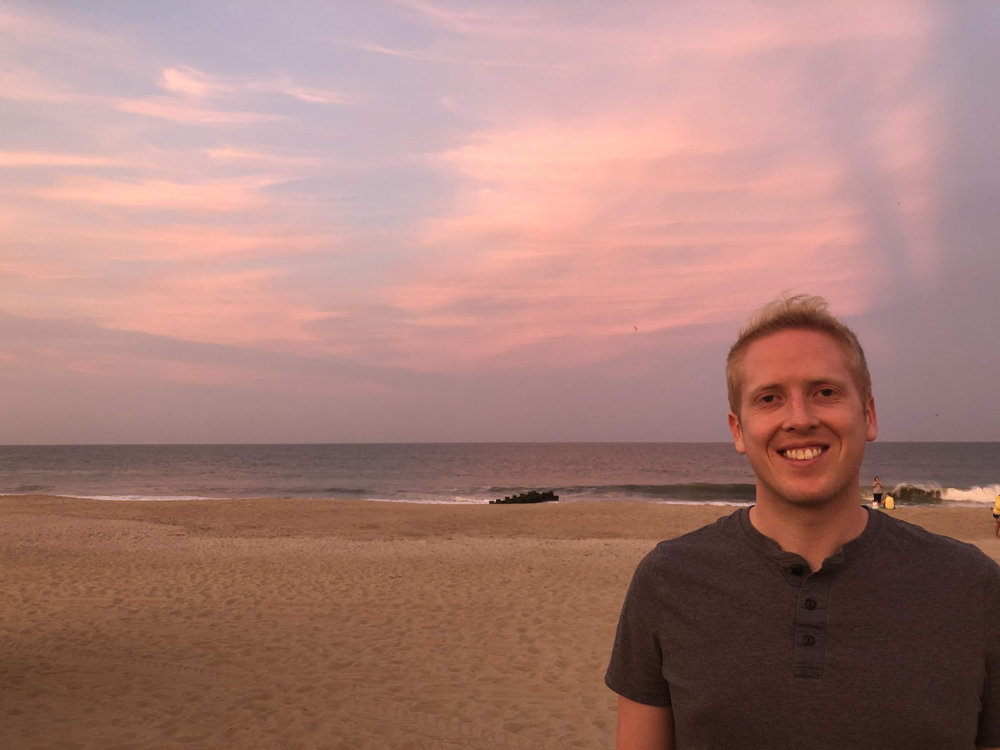

   

Hey, I'm Brady O'Connell! I'm a Software Engineer based in Brooklyn.

My story starts in Gaithersburg, Maryland, where I grew up playing sports (soccer, tennis, and basketball!) and played drums in a hardcore punk band in high school. I've always liked computers and studied Computer Science at the University of Maryland (Go Terps).

After college, I lived in San Francisco for 5 years before moving to Brooklyn. Along the way, I've worked at companies you might've heard of like Google, Uber, and Asana, plus a couple more startups you probably haven't.

I like to play all of the sports but am currently focused on pickleball. I love cities and being car-independent but I also love nature. I've taken multiple months-long sabbaticals between jobs, mostly to backpack around the world, hike, scuba dive, surf, snowboard, and generally engage in novelty-seeking behavior. I love getting lost in Wikipedia rabbit holes, reading speculative fiction, and lurking too much on Reddit and Hacker News. I try to watch a lot of movies and love anything in full IMAX. I've been a vegetarian since I was 13 (before the explosion of new-school mock meat companies!) and these days eat mostly vegan.

One of my strongest hot takes is that Facebook around ~2014 was peak social media, but you can now find me at:
 * [LinkedIn](https://www.linkedin.com/in/bradyoconnell)
 * [Instagram](https://www.instagram.com/brady_oconnell)
 * [Last.fm](https://www.last.fm/user/bradyoactive)
 * [Letterboxd](https://letterboxd.com/bradyoactive)
 * [Hardcover](https://hardcover.app/@brady) - a Letterboxd-like alternative to Goodreads!
 * [Google Maps](https://maps.app.goo.gl/25nLBEs56aBruw8a8) - I leave a lot of reviews for restaurants, attractions, etc.
